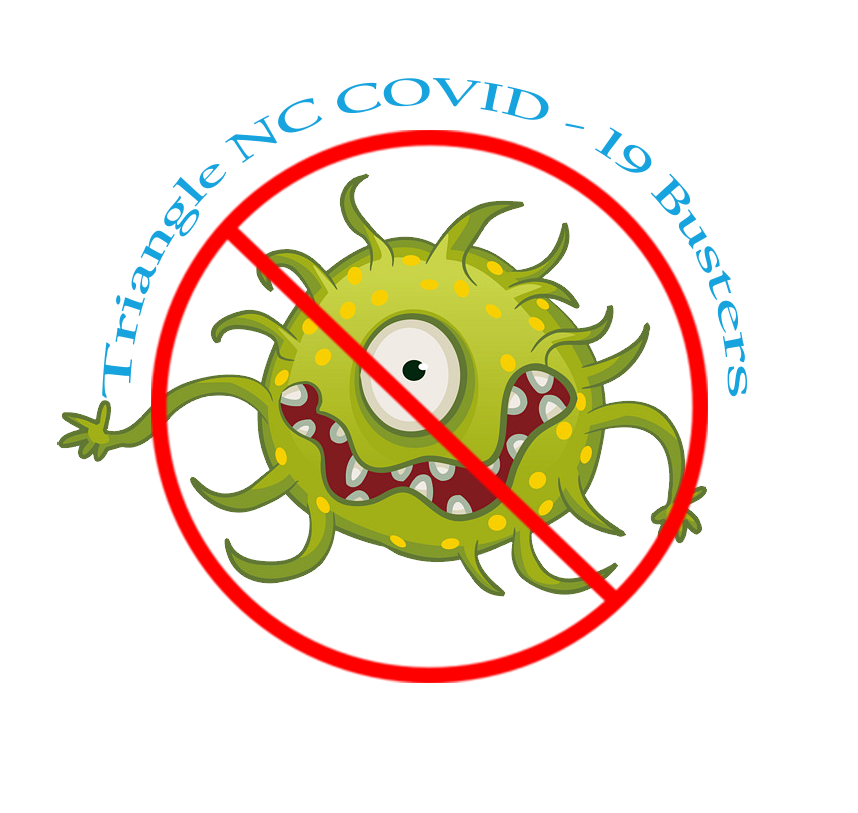
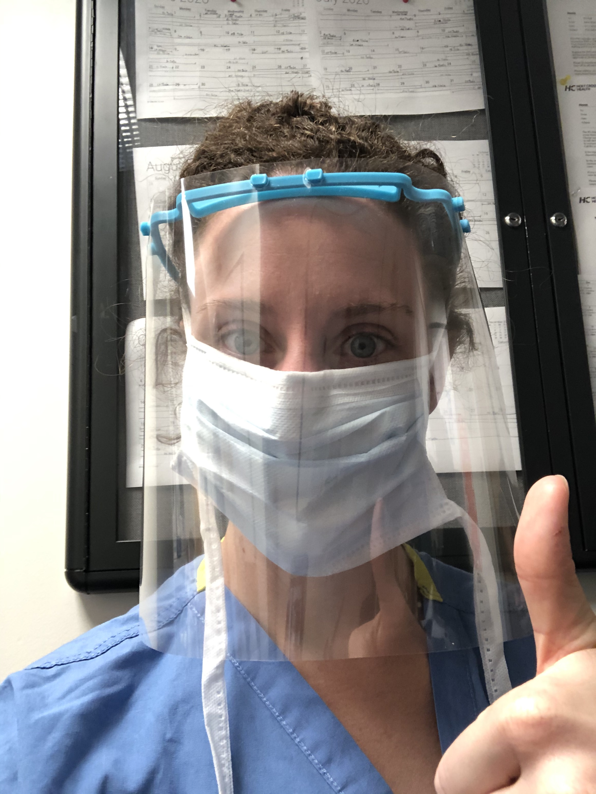

# Volunteers Fighting COVID-19 in the Triangle, NC

Face shields and PPE that protect doctors and nurses from COVID-19 airborne splatter are in short supply.

We are 3D-printing face shields to provide healthcare professionals with the protective gear that they need to stay safe!

<table>
<tr>
<td>
<h2>Print</h2>

Have a 3D Printer? Download the files and sign up so we can coordinate distribution!

<b><a href="docs/print.html">Print Here</a></b>

</td>
<td>

<h2>Volunteer</h2>

Do you have the time and willingness to help out? Tell us your skills!

<b><a href="https://forms.gle/CwF7hVyBP1fBB49A9">Volunteer Here</a></b>
 
Also remember to join us on Slack, link is below!

</td>
<td>

<h2>Request</h2>

We are actively distributing shields to frontline workers!

<b><a href="https://forms.gle/ZrBaD8XHApYGEsFa6">Request PPE</a></b>

</td>
<td>

<h2>Fund</h2>

Fund Protective Gear! Every dollar helps protect our doctors, nurses, and everyone on the front lines!

<b><a href="docs/fund.html">Fund</a></b>

</td>
</tr>

</table>

# Slack chat room

We live and work in the Raleigh - Durham - Chapel Hill metro area just like you.  Please join us on Slack here to chat with us: [Join Slack](https://join.slack.com/t/masksfordocs/shared_invite/zt-dcwc740h-jZtGkDZl8NMGUKzgRXX56g)

Please join the channel `#zlocal-us-nc-triangle`

# Background

As hospitals and front line workers run out of **PPE** (personal protective gear), people around the world are creating solutions to save lives.

We are a bunch of nerdy engineers in the Raleigh - Durham - Chapel Hill metro area collectivley known as "the triangle", and we are 3D printing face shields to help protect workers from airborne splatter.  

I highly recommend it if you are unfamiliar with 3D printers, face shields, and what we are trying to do to check out this YouTube video: [https://youtu.be/sbEj7M3aZIg](https://youtu.be/sbEj7M3aZIg)  I promise it is worth the watch.

Here is an example of my (Sean's) sister up in the DC metro area using a 3D printed mask in their community->

