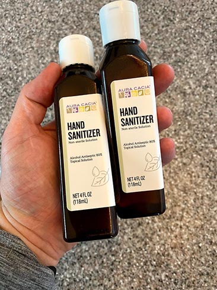
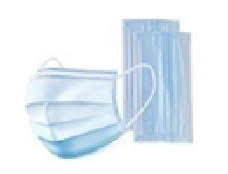
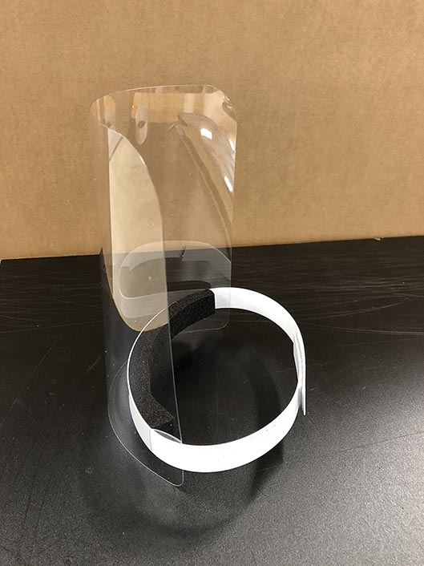

# Purchasing PPE

We are trying to curate a list of local manufactures and suppliers that are now able to supply PPE (personal protective equipment) in North Carolina.

## Table of Contents

* [Low Quantity](#low-quantity)
   * [Weaver Street Market](#weaver-street-market)
* [High Quantity](#high-quantity)
   * [Gilero](#gilero)
   * [Sharpeco](#sharpeco)

# Low Quantity

## Weaver Street Market

[Weaver Street Market](https://www.weaverstreetmarket.coop/) has locations at:

- [Southern Village](https://goo.gl/maps/NeMVTn9aqiYBMj6J6), Chapel Hill (Orange County)
- [Downtown Carrboro](https://goo.gl/maps/55rcySwiaSEC3DVw6) (Orange County)
- [Downtown Hillsborough](https://goo.gl/maps/MzYf3RMJ9Nc9bQ6F6) (Orange County)
- [Downtown Raleigh](https://g.page/WeaverStreetMarketRaleigh) (Wake County)

They are selling:

- hand sanitizer (80% alcohol)
- disposable masks (3 per package at $4.29)
- reusable cloth masks

Pictures:

# High Quantity

I have already talked to two NC manufactures that can produce various PPE.  The only drawback here is they are used to selling larger increments.  We do not want to overwhelm them with small orders or they will not be able to fulfill them.

## Gilero

Website: [https://www.gilero.com/](https://www.gilero.com/)

Gilero is producing face shields.  They have a plant in Pittsboro, NC (Chatham County)

- price per unit: ~$5.30
- minimum order size: 250 units ($5.30 * 250 = $1325)

We can do introductions to Gilero's sales director if you are able to purchase larger quantities, or you can work with us and we can do a group buy option.

I have higher resolution pictures and measurements here: [https://photos.app.goo.gl/SkdmUNiFdrVYxmfP9](https://photos.app.goo.gl/SkdmUNiFdrVYxmfP9

## Sharpeco

Website: [https://sharpeco.net/](https://sharpeco.net/)

Based in Winston Salem, NC they can create and distribute the following PPE:

- cotton masks $3.50 per mask
- face shields $3.50 per shield
- disposable mask (waiting room mask) ~$1 a piece
- acrylic sheeting for waiting rooms (e.g. like a large sneeze guard)

They are used to doing shipment of 1000 units at a time but will work with smaller orders as they come.

So that would be $3500 for 1000 face shields.  Again we can do a group buy, but if you are a larger practice this is a great option.

Pictures:

Sneeze Guard:

Disposable mask:

Cloth mask:

Face Shield

