# Purchasing PPE

We are trying to curate a list of local manufactures and suppliers that are now able to supply PPE (personal protective equipment) in North Carolina.

## Table of Contents

* [Low Quantity](#low-quantity)
   * [BlueHillsCo](#bluehillsco)
   * [Bright View Technologies](#bright-view-technologies)
   * [KatiesKreations121](#katieskreations121)
   * [Topo Distillery](#topo-distillery)
   * [Triangle PPE Incorporated](#triangle-ppe-incorporated)
   * [Weaver Street Market](#weaver-street-market)
* [High Quantity](#high-quantity)
   * [Gilero](#gilero)
   * [Sharpeco](#sharpeco)

# Low Quantity

## BlueHillsCo

Website: [https://www.etsy.com/shop/BlueHillsCo](https://www.etsy.com/shop/BlueHillsCo)

 - They are producing 3D Printed 1500+  Micron Filter Masks, face shields, ear savers (mask extenders) and door openers.  Filter on etsy using **Health**. They are based in  Chapel Hill, North Carolina.  

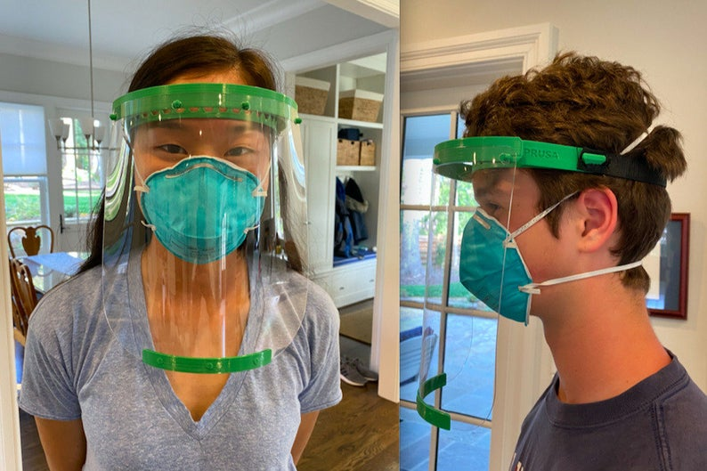

They are also able to do large quantities as well (1000+), but it is more rare to do small quantities so I am listing them here first!

# Bright View Technologies

Website:[https://www.brightviewtechnologies.com/](https://www.brightviewtechnologies.com/products/bright-shield/bright-shield/page.aspx?id=1552)
Bright View Technologies is producing face shields. They are based in Durham, North Carolina.

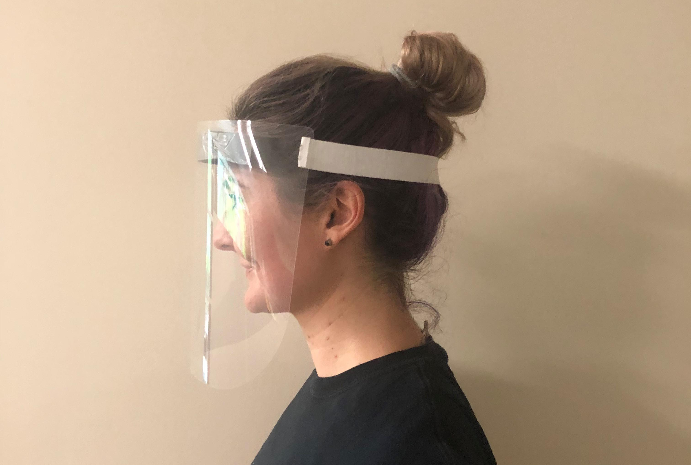

I am putting this under low quantity because they can sell units of 10 via Amazon but they would prefer to sell in increments of 250.  Please put them in contact with your local supplier so that they can do larger orders and drive costs down for everyone.  They can do huge orders as well, so they can produce thousands of shields.

Two ways to order:
- Amazon (higher price per unit): [Amazon link](https://www.amazon.com/dp/B087N14Q48/ref=cm_sw_em_r_mt_dp_U_TQaVEb9BF6G2H), price per unit is 7.95 for a 10 pack
- Direct [https://www.brightviewtechnologies.com/contact/contact-us/contact-us-form~form.aspx](https://www.brightviewtechnologies.com/contact/contact-us/contact-us-form~form.aspx) fill out the form and put in the comments what you are looking to purchase.
  - 50 units at 3.95 per shield ($197.5)
  - 250 units at 3.75 per shield ($937.5)
  - larger quantities contact them

## KatiesKreations121

Website: [https://www.etsy.com/shop/KatiesKreations121](https://www.etsy.com/listing/810653827/handmade-mask-with-pocket-filtration)
Based in Chapel Hill, NC

They are selling:

- Hand-made cloth masks $7

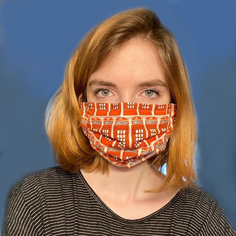

# Topo Distillery

Website: [http://www.topodistillery.com/hand-sanitizer](http://www.topodistillery.com/hand-sanitizer)
Based in Chapel Hill, NC

Selling hand sanitizer in the following increments:

- 18 oz $16.13
- 1 gallon $64.50
- 2.5 gallons $150.00
- bulk (20 gallons or more)

Use the website link above to order

# Triangle PPE Incorporated

Website:  [https://www.triangleppe.com/trianglecovid](https://www.triangleppe.com/trianglecovid)

Selling:  Locally Manufactured Face Shields, both non-branded, or branded with custom company name & logo.

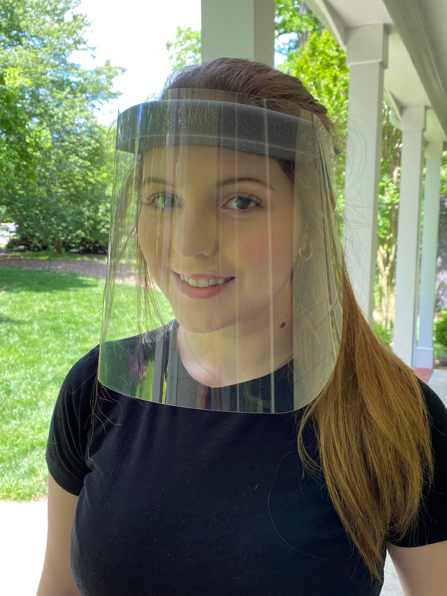

<table style="width:100%">
  <tr>
    <th>Quantity</th>
    <th>Non-Branded</th>
    <th>Custom Branded</th>
  </tr>
  <tr>
    <td>10 - pack (price per Shield)</td>
    <td>$5.00</td>
    <td>$7.00</td>
  </tr>
  <tr>
    <td>50 – pack (price per Shield)</td>
    <td>$4.50</td>
    <td>$5.75</td>
  </tr>
  <tr>
    <td>100 – pack (price per Shield)</td>
    <td>$3.95</td>
    <td>$5.10</td>
  </tr>  
</table>

Call us for prices for larger quantities.  919-525-1418.

## Weaver Street Market

[Weaver Street Market](https://www.weaverstreetmarket.coop/) has locations at:

- [Southern Village](https://goo.gl/maps/NeMVTn9aqiYBMj6J6), Chapel Hill (Orange County)
- [Downtown Carrboro](https://goo.gl/maps/55rcySwiaSEC3DVw6) (Orange County)
- [Downtown Hillsborough](https://goo.gl/maps/MzYf3RMJ9Nc9bQ6F6) (Orange County)
- [Downtown Raleigh](https://g.page/WeaverStreetMarketRaleigh) (Wake County)

They are selling:

- hand sanitizer (80% alcohol)
- disposable masks (3 per package at $4.29)
- reusable cloth masks

Pictures:

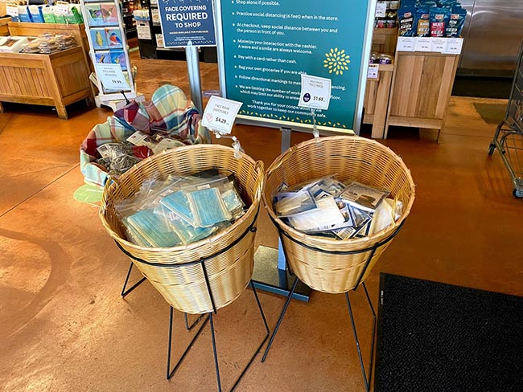
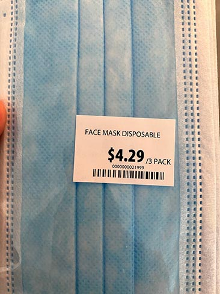
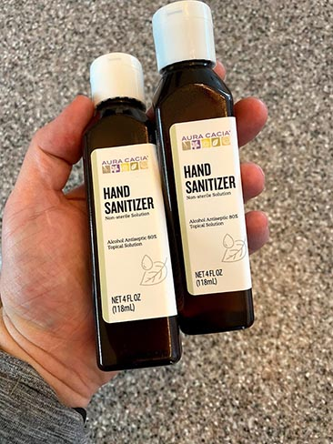

# High Quantity

I have already talked to two NC manufactures that can produce various PPE.  The only drawback here is they are used to selling larger increments.  We do not want to overwhelm them with small orders or they will not be able to fulfill them.

## Gilero

Website: [https://www.gilero.com/](https://www.gilero.com/)
Gilero is producing face shields.  They have a plant in Pittsboro, NC (Chatham County)

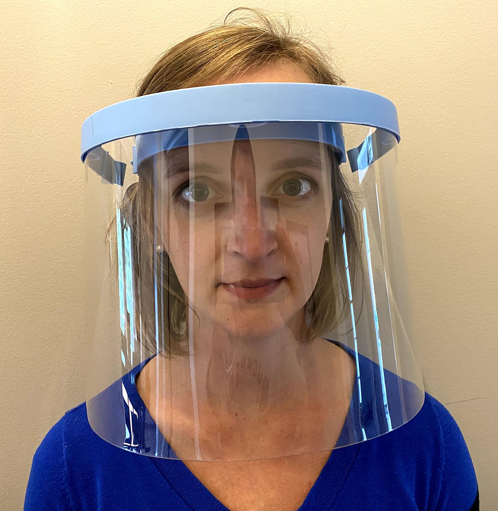

- price per unit: ~$5.30
- minimum order size: 250 units ($5.30 * 250 = $1325)

We can do introductions to Gilero's sales director if you are able to purchase larger quantities, or you can work with us and we can do a group buy option.

I have higher resolution pictures and measurements here: [https://photos.app.goo.gl/SkdmUNiFdrVYxmfP9](https://photos.app.goo.gl/SkdmUNiFdrVYxmfP9)

## Sharpeco

Website: [https://sharpeco.net/](https://sharpeco.net/)

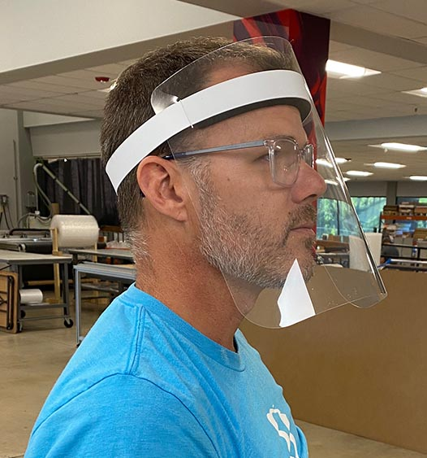

Based in Winston Salem, NC they can create and distribute the following PPE:

- cotton masks $3.50 per mask
- face shields $3.50 per shield
- disposable mask (waiting room mask) ~$1 a piece
- acrylic sheeting for waiting rooms (e.g. like a large sneeze guard)

They are used to doing shipment of 1000 units at a time but will work with smaller orders as they come.

So that would be $3500 for 1000 face shields.  Again we can do a group buy, but if you are a larger practice this is a great option.

Pictures:

Sneeze Guard:

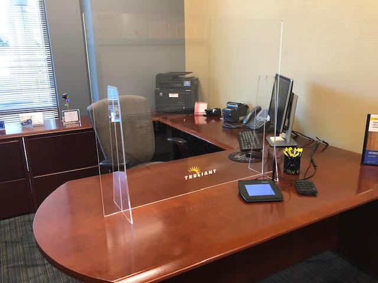

Disposable mask:

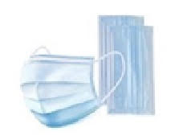

Cloth mask:

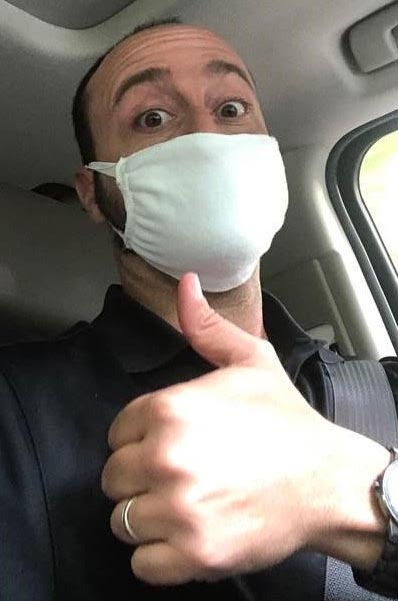

Face Shield

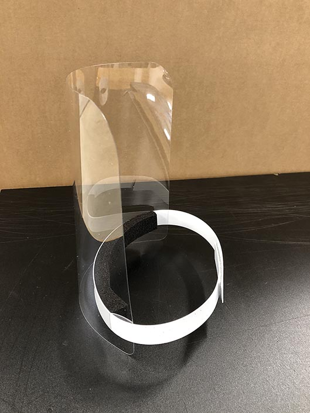
