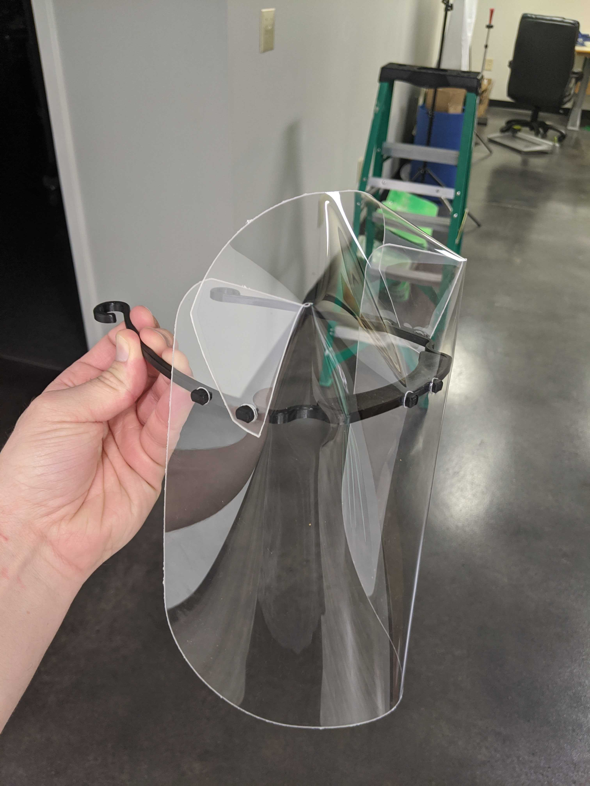
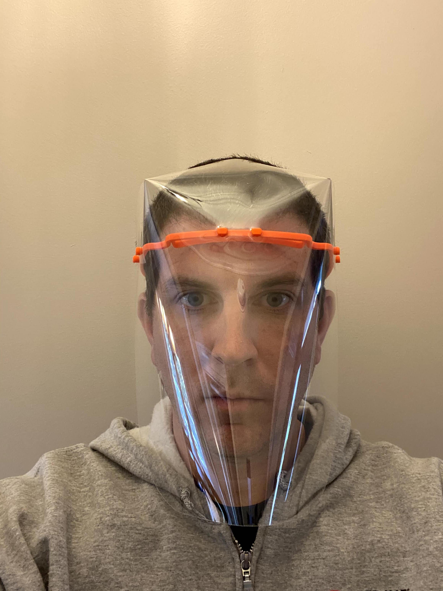
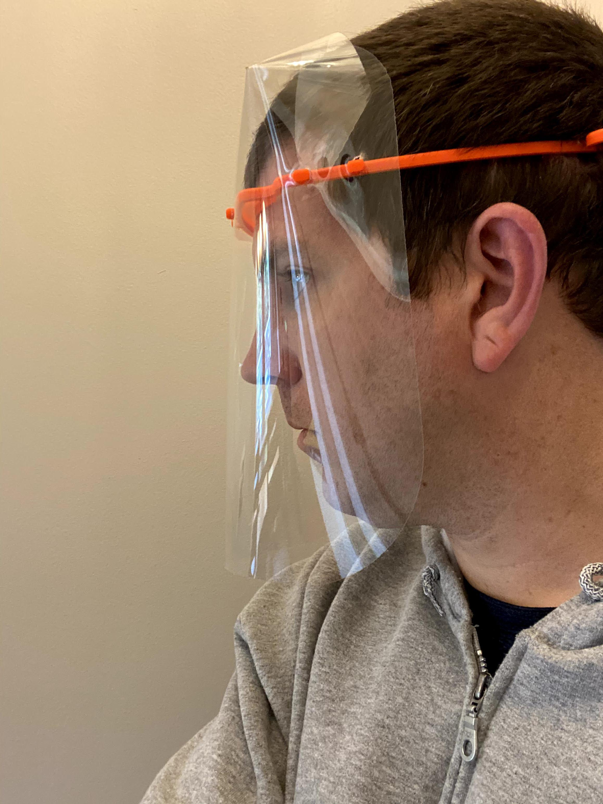
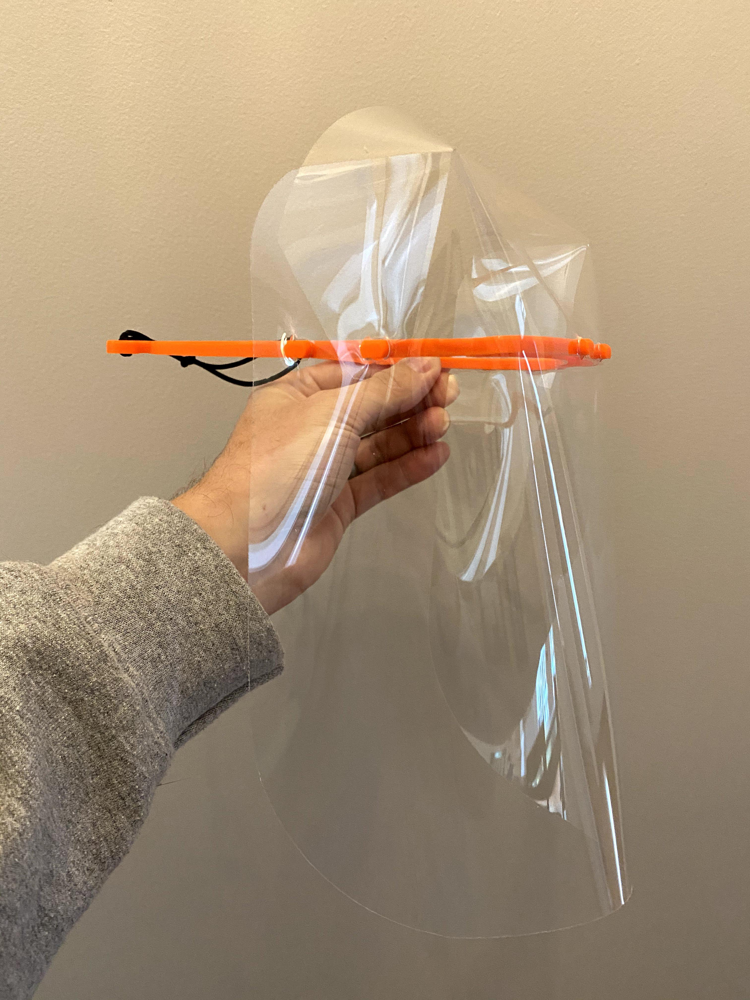
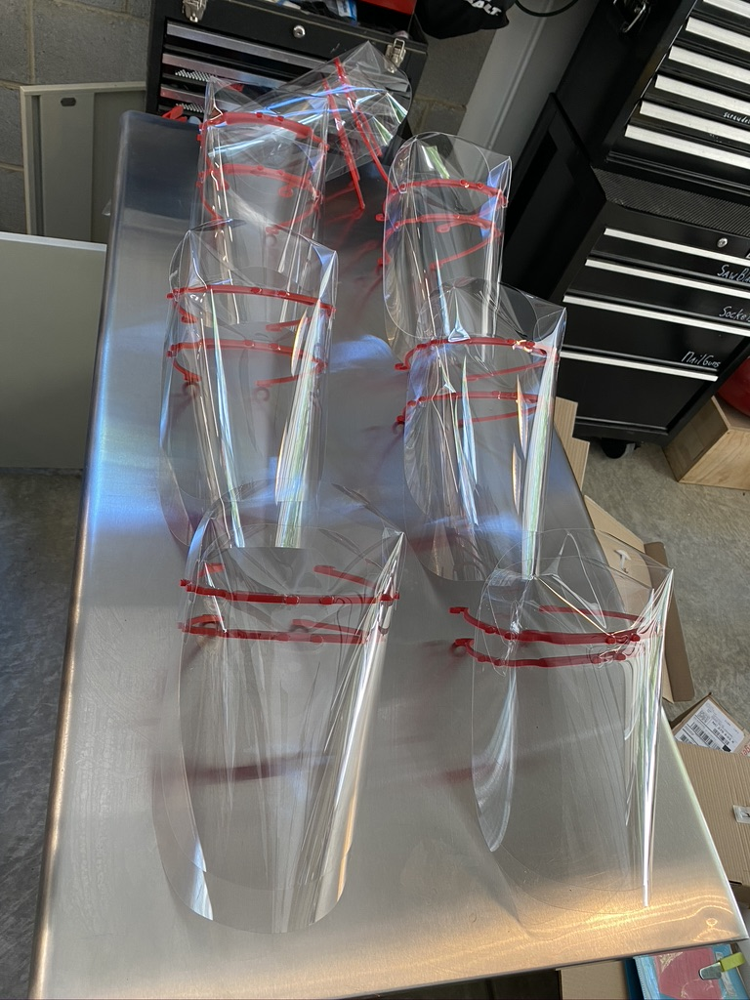
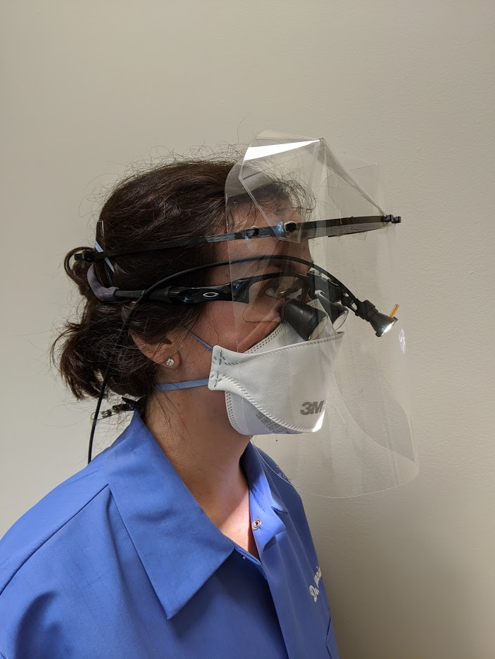

# Print Face Shields

**UPDATE JULY 13TH 2020** WE ARE CEASING PRODUCTION.  PLEASE DO NOT 3D PRINT ANY MORE FRAMES.

Why is this group stopping production of face shields?

- **Demand**: The in-bound requests for shields has gone down significantly.  When someone requests PPE from our group it fills out a google spreadsheet and we have volunteers look at it.  This is a good sign that other avenues of obtaining face shields are working (e.g. via the government or normal purchasing from suppliers).  See more info in the next point->

- **Local Manufactures**: The plan was also originally to "close the gap" on providing PPE (personal protective equipment) because no one was producing PPE locally (North Carolina)  However, there are now local manufactures creating face shields much faster than we can.  I have created a curated list here: https://trianglecovid.com/docs/buy_ppe.html.

- **Volunteer Burnout**: Leadership for this group is assuming that more and more folks are burning out and because we are having harder and harder times getting volunteers to deliver, print or assemble.  It is very time intensive to use 3D printers and manual assembly versus what local manufactures are doing.  With local manufactures coming online we can donate what we have left in inventory and just help distribution donations.

Is this group going away?

No, we are going to move more towards distribution of donations and just helping people request PPE from proper government sources or manufactures.

## FRAME

[https://3dverkstan.se/protective-visor/protective-visor-versions/](https://3dverkstan.se/protective-visor/protective-visor-versions/)

Download is here: [https://www.youmagine.com/designs/protective-visor-by-3dverkstan](https://www.youmagine.com/designs/protective-visor-by-3dverkstan)

## EXTENSION

The dental extension can be found here: [https://www.modestmachines.com/ppe](https://www.modestmachines.com/ppe)

Please report problems to [sean.cavanaugh@masksfordocs.com](mailto:sean.cavanaugh@masksfordocs.com)

# Slack chat room

We live and work in the Raleigh - Durham - Chapel Hill metro area just like you.  Please join us on Slack here to chat with us: [Join Slack](https://join.slack.com/t/masksfordocs/shared_invite/zt-e8439lwg-tY7rXI1ZwP7TO1jqseVP2A)

Please join the channel `#zlocal-us-nc-triangle`

# Example Pictures

3DVerkstan 6-hole design with transparent plastic that will go up over persons head:

Picture taken from in front:

Picture taken from side:

Holding mask:

Delivered to UNC hospitals

# Loupes

The group is using modified designs to extend face shields for use with loupes:

]

[RETURN TO MAIN SITE](../README.md)
