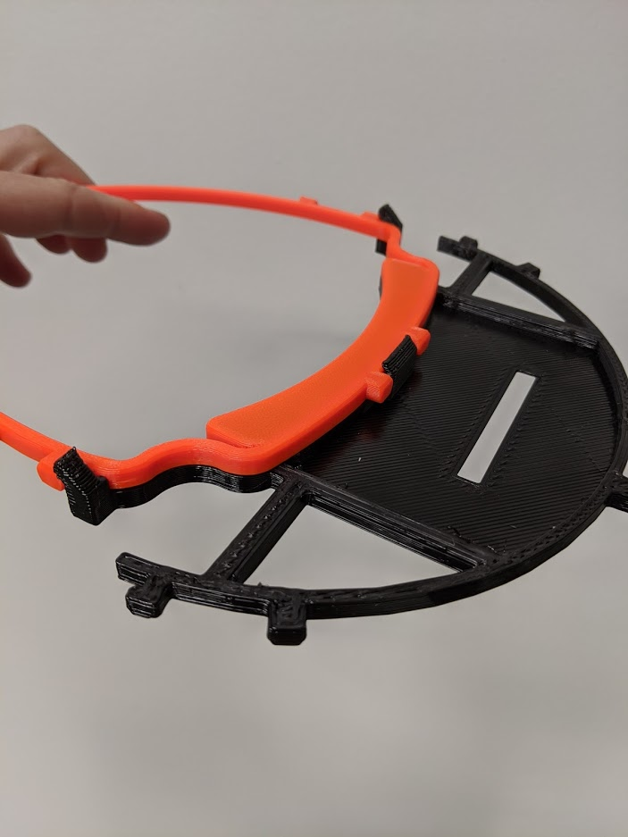

# Print Face Shields

**UPDATE JUNE 16TH 2020** We only need specific amounts of frames or extensions to be printed.  The 3D files are provided below. Before you print anything please sign up for a slot (increments of 50)
[https://www.signupgenius.com/go/9040b4aabaf22a1fb6-frame](https://www.signupgenius.com/go/9040b4aabaf22a1fb6-frame)

Here is a picture of the normal plastic 3D printed frame, and the 3D printed extension.  The clear plastic shield is already cut and we just need these two parts.

]

You can contact me at [sean.cavanaugh@masksfordocs.com](mailto:sean.cavanaugh@masksfordocs.com) or join us on slack.  We also need money, please donate to the [US-NC-Triangle group here](https://local.masksfordocs.com/us-nc-triangle).

Right now we are concentrating on face shields since we do not have the capability to make N95 masks with 3D printers.

Specifically our group is currently concentrating on printing the 3DVerkstan North America 6-hole design.  I am working with some folks in Durham that can make the transparent shield to attach to this visor.  

[https://3dverkstan.se/protective-visor/protective-visor-versions/](https://3dverkstan.se/protective-visor/protective-visor-versions/)

Download is here: [https://www.youmagine.com/designs/protective-visor-by-3dverkstan](https://www.youmagine.com/designs/protective-visor-by-3dverkstan)

Please report problems to [sean.cavanaugh@masksfordocs.com](mailto:sean.cavanaugh@masksfordocs.com)

# Slack chat room

We live and work in the Raleigh - Durham - Chapel Hill metro area just like you.  Please join us on Slack here to chat with us: [Join Slack](https://join.slack.com/t/masksfordocs/shared_invite/zt-e8439lwg-tY7rXI1ZwP7TO1jqseVP2A)

Please join the channel `#zlocal-us-nc-triangle`

# Example Pictures

3DVerkstan 6-hole design with transparent plastic that will go up over persons head:

Picture taken from in front:

Picture taken from side:

Holding mask:

Delivered to UNC hospitals

# Loupes

The group is using modified designs to extend face shields for use with loupes:

]

[RETURN TO MAIN SITE](../README.md)
